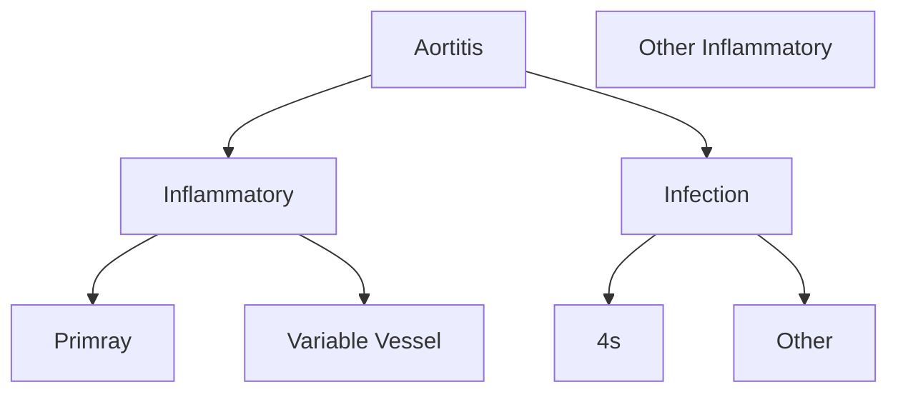
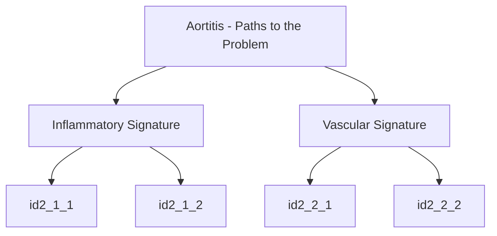

# Aortitis

## Inflammatory

### Primray
- Giant Cell Arteritis
- Takayasu
- Idiopathic Isolated aortitis

### Variable Vessel
- IgG4
- Cogan's
- Behcets
- Relapsing
- Polychondritis

### Other Inflammatory
- Erdheim Chester[^1]
- Spondyl-Arthropathy

## Infection

### 4s
* staph
* strep
* salmonella
* syphilis

### Other infection
* Mycobacteria
* Bartonella
* Klebsiella
* Clostridium septicum
* Aspergillus

## Aortitis - Paths to the Problem

### Inflammatory Signature

- Inflammatory Chest Pain
- Inflammatory Abdominal Pain +/- palpable pusatile mass
- Inflammatory Back Pain
- Fever of Unknown Origin
-
### ischemia
- claudication
- emboli
	- limb ischemia
	- organ ischemia
### Bleeding
- GI Bleeding
- Hemopericardium
- Hemothorax

[^1]: Erdheim-Chester disease (ECD) is a rare non-Langerhans histiocytic multisystem disorder. ECD is most commonly manifest as multifocal sclerotic lesions of the long bones demonstrating sheets of foamy histiocytes on biopsy, with or without histiocytic infiltration of extra-osseous tissues.
