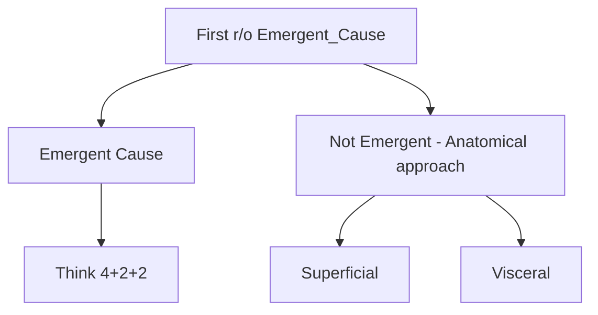

# Chest pain

## Emergent Cause
| Caridac                 | Pulmonary          | Esophageal |
|-------------------------|--------------------|------------|
| Acute Coronary syndrome | Pulmonary Embolsim | Rupture    |
| Aortic Dissection       | Pneumothorax       | Impaction  |
| Tamponade               |                    |            |
| Takotsubo               |                    |            |

## Superficial

### MSK
- Costochondritis
- Rib fracture

### skin
- Zoster

### Nervous
- Thoracic radiculopathy

## Visceral

### GI
- Spasm
- Reflux
- Ulcers

### Cardiac
- Heart failure
- Aortic stenosis

### Pulmonary
- Pneumonia
- Diaphragmatic hernia

### Mediastinum
- Fat necrosis
