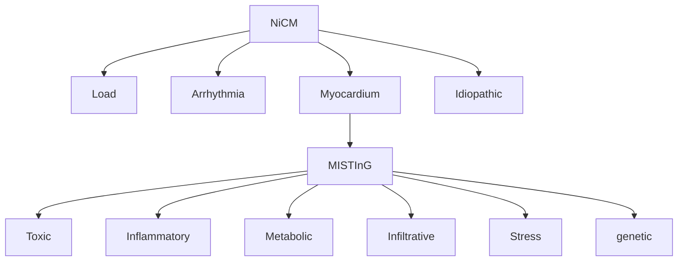

# Heart Failure

## Reduce EF

### Most common etiology
- hypertension
- valvulopathy
- Arrhythmia
- Toxic
- Idiopathic

### load
- Primary HTN
- Valvulopathy

### Arrhythmia
- Tachyarrhythmia
- A-fib
- Pacemaker
- PVC

### Myocardium

#### Toxic
- Alcohol
- Cocaine
- Radiation
- Chemotherapy
	- Anthracylines
	- Trastuzumab
	- 5-FU

#### Inflammatory
- Infectious
	- HIV
	- Viral myocarditis
	- Chagas disease
- Autoimmune
	- Giant cell myocarditis
	- Eosinophilic myocarditis
	- RA, SLE

#### Metabolic
- Endocrine
	- Thyroid
	- Pheochromocytoma
- Nutritional
	- Thiamine
	- Selenium

#### Infiltrative
- Amyloid
- Sarcoid
- Hemochromatosis

#### Stress
- Takotsubo
- Sepsis
- Peripartum

#### Genetic
- Familial DCM
- Left ventricular noncompaction
- Muscular dystrophy
- Hypertrophic cardiomyopathy

## Hyperacute

## Weight Loss
